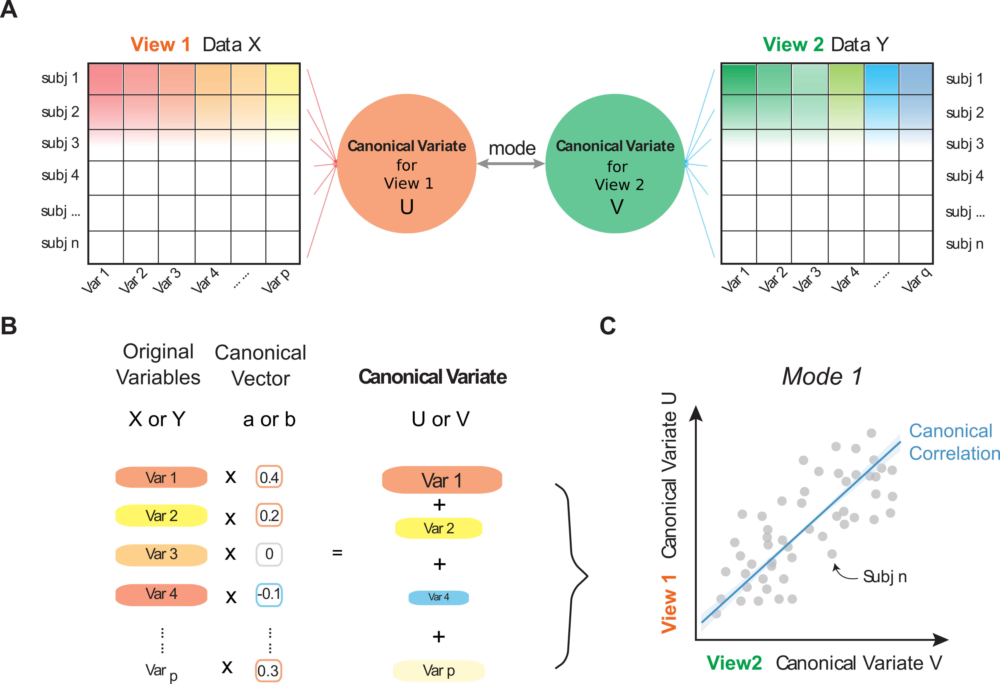

class: left, middle, inverse

layout: true

---

class: center, middle, inverse

# Finding the needle in a better haystack

## An updated guide to canonical correlation analysis

### Hao-Ting Wang

#### University of Sussex

[htwangtw.github.io/cca-talk-2021](https://htwangtw.github.io/cca-talk-2021)

---

layout: false

# Acknowledgements

--

## Prof Danilo Bzdok (McGill University)

## Prof Jonny Smallwood (Queen's University, Canada)

--

## Dr Cedric Xia (University of Pennsylvania)

## Prof Janaina Mourao-Miranda (University College London)

## Prof Theodore Satterthwaite (University of Pennsylvania)

## Prof Danielle Bassett (University of Pennsylvania)

???

Thank people first

---

class: left, middle, inverse

# *The future of data is multivariate.*

.right[*Yours Truly (2021)*]

???

Human data has too much inter dependency of other stuff
And a lot of other stuff

---

class: left, middle, inverse

# *Data is big. Brain is smol.*

.right[*Guess who made this up (2021)*]

???

Summarising multivariate stats is difficult
Compressing it make it easier

---

class: left, top, inverse

.left-column[
    # Outline
]

--

.right-column[
## What's CCA?

## Features of CCA

## Limitations

## Different sub-class of CCA

## Useful projects and papers

## A better haystack?
]

---

# What's Canonical Correlation Analysis (CCA)?

---

layout: false

.left-column[
  ## Brief history
]

.right-column[

First used in 1937. Lack of usage in the past due to (probably):

- Lack of understanding in multivariate technics

- No good use cases (data was not big enough, or brain was bigger, back then)

Revival now-ish, possibly due to

- The rise of data science

- We have a lot more data now

- We realised our brain is smol
]

---

layout: false

.left-column[
  ## Brief history
  ## Glossory
]

.right-column[

]

---

layout: false

.left-column[
  ## Brief history
  ## Glossory
  ## Summary
]

.right-column[

- View: set of features that are intercorrelated

- Varitate: a shrinked representation of all features in a view

- Vector: coefficents

- Mode: a pair of variates

- Canonical correlation: correlation of a pair of variates

]

---

class: center, middle, inverse

## Traits of Canonical Correlation Analysis

---

layout: false

.left-column[
  ## Joint information compression
]

.right-column[

- Two.red[*] views of data.

- Summarize the relationships into a lesser number of statistics

- Preserving the main facets of the relationships

- In this perspective, CCA.blue[*] is similar to a PCA.

.footnote[.red[*] There are variasions for multiple views.]

.footnote2[.blue[*] Linear CCA.]

]

---

layout: false

.left-column[
  ## Joint information compression
  ## Symmetry

]

.right-column[

- The two views has no dependency on eachother

- Canonical correlation.red[*] is Pearson's correlation of the variates of a mode

.footnote[.red[*]Basic linear CCA.]

]

---

layout: false

.left-column[
## Joint information compression
## Symmetry
## Multiplicity

]

.right-column[

- You can get multiple modes

- CCA.red[*] vs MANOVA/Multivariate Multiple Regression:

    - MANOVA/Multivariate Multiple Regression is describing the surface
    - CCA give you all the details

.footnote[.red[*]Basic linear CCA.]

]

---

class: center, middle, inverse

## Different sub-class of CCA

---

class: center, middle, inverse

## A better haystack?

--

## Sample to feature ratio

---

class: inverse

# More Information

???

important recent paper in this slide

---

class: center, middle, inverse

## Questions, Comments, Feedbacks?

slides: [htwangtw.github.io/cca-talk-2021](https://htwangtw.github.io/cca-talk-2021)

--
