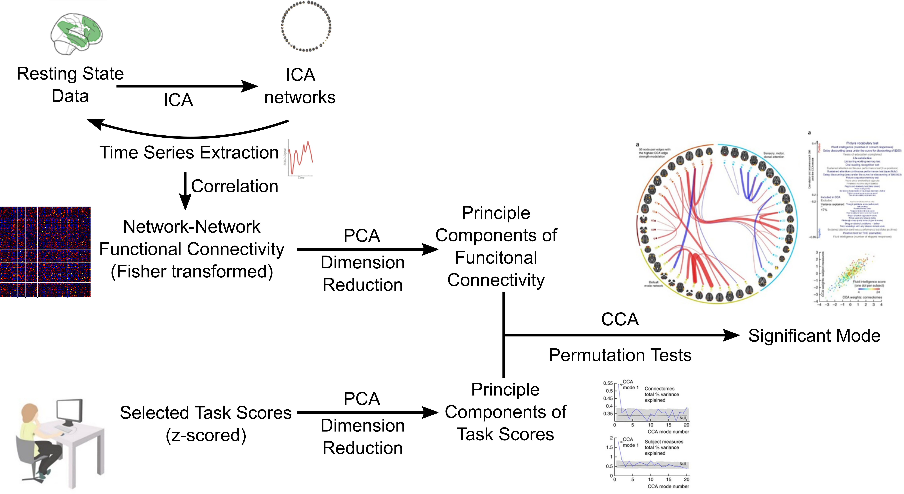
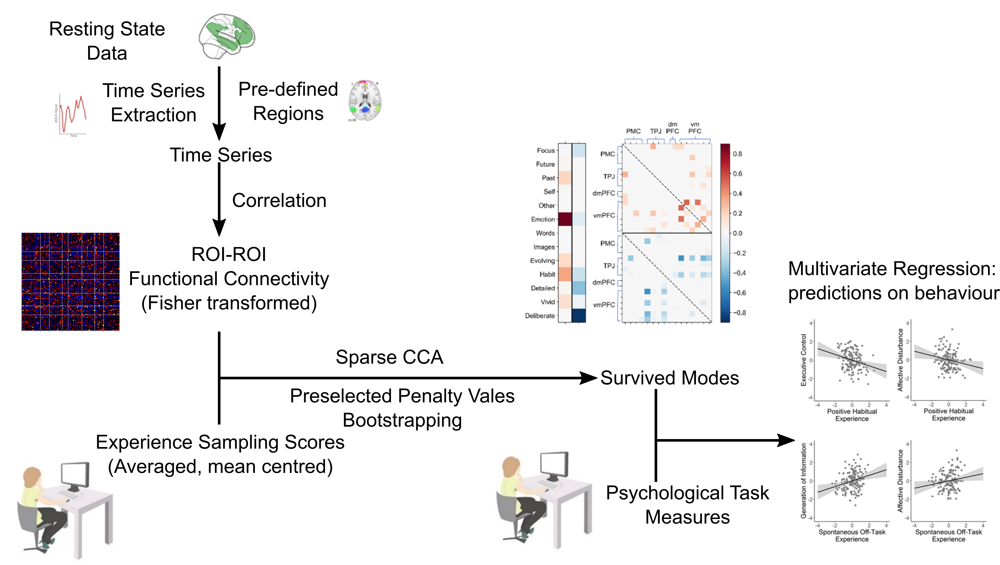
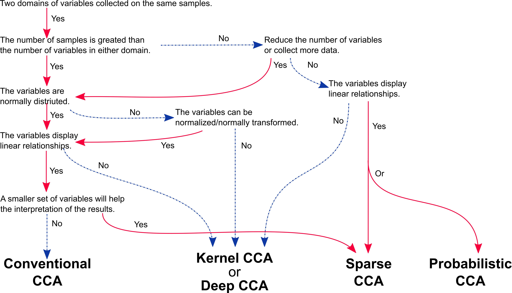

class: left, middle, inverse

layout: true

---

class: center, middle, inverse

# Finding the needle in a better haystack

## An updated guide to canonical correlation analysis

### Hao-Ting Wang

#### University of Sussex

[htwangtw.github.io/cca-talk-2021](https://htwangtw.github.io/cca-talk-2021)

---

layout: false

# Acknowledgements

--

## Prof Danilo Bzdok (McGill University)

## Prof Jonny Smallwood (Queen's University, Canada)

--

## Dr Cedric Xia (University of Pennsylvania)

## Prof Janaina Mourao-Miranda (University College London)

## Prof Theodore Satterthwaite (University of Pennsylvania)

## Prof Danielle Bassett (University of Pennsylvania)

???

Thank people first

---

class: left, middle, inverse

# *The future of data is multivariate.*

.right[*Yours Truly (2021)*]

???

Human data has too much interdependency of other stuff
And a lot of other stuff

---

class: left, middle, inverse

# *Data is big. The brain is smol.*

.right[*Guess who made this up (2021)*]

???

Summarising multivariate stats is difficult
Compressing it makes it easier

---

class: left, top, inverse

.left-column[
    # Outline
]

--

.right-column[
## What's CCA?

## Traits of CCA

## Limitations

## Different variations of CCA

## Realistic problems and a better haystack?
]

---

class: inverse, middle, center

# What's Canonical Correlation Analysis (CCA)?

---

layout: false

.left-column[
  ## What's CCA
  ### Brief history
]

--
.right-column[

First used in 1937. Lack of usage in the past due to (probably):

- Lack of understanding in multivariate technics

- No good use cases (data was not big enough, or brain was bigger, back then)
]

---

layout: false

.left-column[
  ## What's CCA
  ### Brief history
]

.right-column[

First used in 1937. Lack of usage in the past due to (probably):

- Lack of understanding in multivariate technics

- No good use cases (data was not big enough, or brain was bigger, back then)

Mother of all multivariate methods.

]

---

layout: false

.left-column[
  ## What's CCA
  ### Brief history
]

.right-column[

First used in 1937. Lack of usage in the past due to (probably):

- Lack of understanding in multivariate technics

- No good use cases (data was not big enough, or brain was bigger, back then)

Mother of all multivariate methods.

Revival now-ish, possibly due to

- The rise of data science.

- We have a lot more data now.

- We realised our brain is smol.
]

---

layout: false

.left-column[
  ## What's CCA
  ### Brief history
]

.right-column[

First used in 1937. Lack of usage in the past due to (probably):

- Lack of understanding in multivariate technics

- No good use cases (data was not big enough, or brain was bigger, back then)

Mother of all multivariate methods.

Revival now-ish, possibly due to

- The rise of data science.

- We have a lot more data now.

- We realised our brain is smol.

In neuroscience:

- Lots of work in the signal processing literature.

- Signal filtering (Cordes et al., 2012); multimodal fusion (Calhoun and Sui, 2016)

- Gained popularity since Smith 2015 HCP data analysis.

]

---

layout: false

.left-column[
  ## What's CCA
  ### Brief history
  ### Glossory
]

--

.right-column[

]

---

layout: false

.left-column[
  ## What's CCA
  ### Brief history
  ### Glossory
  ## Summary
]

.right-column[

- View: a set of features that are intercorrelated

- Variate: a shrunk representation of all features in a view

- Vector: coefficients

- Mode: a pair of variates

- Canonical correlation: correlation of a pair of variates

]

---

class: center, middle, inverse

## Traits of Canonical Correlation Analysis

---

layout: false

.left-column[
  ## Traits of CCA
  ### Symmetry
]

--

.right-column[

- Two.red[*] views of data.

- No dependent/independent variables, just two views of data.

- The two views have no dependency on each other.

- Canonical correlation.blue[*] is Pearson's correlation of the variates of a mode.

.footnote[.red[*] There are variasions for multiple views.]

.footnote2[.blue[*] Basic linear version.]
]

---

---

layout: false

.left-column[
  ## Traits of CCA
  ### Symmetry
  ### Joint information compression
]

--

.right-column[

- Summarise the relationships into a lesser number of statistics

- Preserving the main facets of the relationships

- In this perspective, CCA.blue[*] is similar to a PCA.

.footnote[.blue[*] Basic linear version.]

]

---

layout: false

.left-column[
## Traits of CCA
### Symmetry
### Joint information compression
### Multiplicity
]

--

.right-column[

- PCA.blue[*] has the same property.

- You can get multiple modes.

- Each mode is orthogonal with the other.

- Variance explained reduces in the later modes.

- CCA.blue[*] vs MANOVA/Multivariate Multiple Regression:

    - MANOVA/Multivariate Multiple Regression is describing the surface
    - CCA give you all the details

.footnote[.blue[*] Basic linear version.]

]

---

---

---

layout: false

.left-column[
## Traits of CCA
### Joint information compression
### Symmetry
### Multiplicity
## Supervised vs unsupervised vs inferencing?
]

--

.right-column[
CCA or any statistical method can be all three.

  - ML (supervised or unsupervised): use model estimation for prediction or description.
  - Statistical inference: make precise statements about the contribution of features.

**Before any inferencing statistics (Wilka's Lambda, F-test etc..), model estimation needs to happen. **

]

---

class: center, middle, inverse

## Limitations

---

layout: false

.left-column[
  ## Limitations
  ### Sample size
]

--

.right-column[

  - Given data of two views n x p and n x q

  - n < min(p, q)

  - In nonlinear methods, this limitation can be violated.red[*]

  - Compress data before performing CCA (see Smith 2015).

  .footnote[.red[*] But not a great idea. We will talk about it later.]
]

???

---

layout: false

.left-column[
  ## Limitations
  ### Sample size
  ### Scale invariant
]

--

.right-column[

- Mean centre vs original data produces the same results.

- Correlation only cares about variance in data.

- I recommend standardising your data to prevent confusion in interpretation.

]

---

layout: false

.left-column[
  ## Limitations
  ### Sample size
  ### Scale invariant
  ### Gaussian normality
]

--

.right-column[

Linear statistical methods require data to normally distributed.

- But in psychology data don't always fit this assumption.

- Consider variations of CCA if normality assumption is violated.red[*].

.footnote[.red[*] You are entering the field of heavy DIY. Be prepared for frustration and low return.]

]

???

---

class: center, middle

---

class: center, middle, inverse

## Different variations of CCA

---

layout: false

.left-column[
  ## Variations of CCA
  ### Probablility CCA
]

--

.right-column[

  - Bach, F. R., & Jordan, M. I. (2005). A probabilistic interpretation of canonical correlation analysis.

  - Root of variaous mordern variations.

  - Linear CCA recap: find the **maximally correlated** *linear projections* of two views of data.

  - PCCA re-express it with probability language

| PCCA                                    | CCA                                     |
|-----------------------------------------|-----------------------------------------|
| Model shared latent variables           | Two views have similar hidden pattern   |
| Independence assumption                 | Orthogonality constraint                |
| Unit variance                           | Scale invariant (Unit length)           |
| Maximum likelihood                      | Maximum correlation                     |

]

???

---

layout: false

.left-column[
  ## Variations of CCA
  ### Probablility CCA
  ### Multi-view CCA
]

--

.right-column[

  - Perform CCA on multiple views of data.

  - Maximizes inter-set correlation: the ratio of the between-set covariance, over the within-set covariance

  - Related method: Generalized Procrustes Analysis (Gower, 1975), Hyperalignment(Haxby et al., 2011)

]

???

---

layout: false

.left-column[
  ## Variations of CCA
  ### Probablility CCA
  ### Multi-view CCA
  ### Sparse CCA
]

--

.right-column[

  - There are lots of sparse CCA algorithms.

  - Common aim: perform feature selection as well as CCA.

  - Shrink contribution of some feature to zero.

]

???

---

layout: false

.left-column[
  ## Vairations of CCA
  ### Probablility CCA
  ### Multi-view CCA
  ### Sparse CCA
  ### Deep CCA
]

.right-column[
  - All the deep learning hype.

  - Use two deep NN instead of linear model, optimise for maximum likelihood.

]

???

---

class: center, middle, inverse

## Realistic problems and a better haystack?

---

layout: false

.left-column[
  ## Realistic problems
]

--

.right-column[

- It's hard to do all these analyses.

- Lots of time spent, probably no results.

- No settled consensus in how to evaluate the performance of CCA in ML context..red[*]

- Very difficult to visualise results.

- Better algorithms coming out all the time.

- Garbage in, garbage out.

- Canoncial correlation < 0.65: Stablility of solution not guarenteed. [See section 4.3](https://onlinelibrary.wiley.com/doi/full/10.1002/hbm.25373)

.footnote[.red[*] Let's be fair - there's no consensus of that on a lot of algorithms in ML.]

]

???

---

layout: false

.left-column[
  ## Realistic problems
  ## Better haystack?
  ### Data and theory
]

.right-column[
### Reduce feature number

 - Given data of two views n x p and n x q, the sample size should be more than 50 % of the max(p, q)

 - Multiple posters benchmarking this from OHBM 2020.

### Improve the features

Experiment, questionnaire measure, brain data feature extraction.

- Better way to summarise full brain functional connectivity than the raw edges.

- Investigate specific network.

]

???

---

layout: false

.left-column[
  ## Realistic problems
  ## Better haystack?
  ### Data and theory
  ### Tools
]

.right-column[

### Open up your parameters

- Report subject-to-feature ratios and canonical correlation of mode regardless of stability.

- If possible, share your code.

### New tools on the raise

- Permutation scheme corrected for accessing multiple modes (Winkler 2020)

- [CCA zoo](https://doi.org/10.5281/zenodo.4925892): Collection of CCA algorithms in Python.

- Nested cross-validation (See a chaotic implementation in Wang 2018 Neuroimage) is supported in SciKit-Learn natively.

]
---

class: inverse

# More Information

A good technical review with a similar structure as Wang 2020

https://onlinelibrary.wiley.com/doi/full/10.1002/hbm.25090

Good blog posts:

https://gregorygundersen.com/blog/2018/07/17/cca/

https://gregorygundersen.com/blog/2018/09/10/pcca/

Good overall tutorial in SAS

https://online.stat.psu.edu/stat505/lesson/13/13.1

Winkler 2020: CCA permutation tests

https://doi.org/10.1016/j.neuroimage.2020.117065

Yang 2021: benchmarking CCA sample - feature ratios

https://onlinelibrary.wiley.com/doi/full/10.1002/hbm.25373

???

an important recent paper in this slide

---

class: center, middle, inverse

## Questions, Comments, Feedbacks?

slides: [htwangtw.github.io/cca-talk-2021](https://htwangtw.github.io/cca-talk-2021)
